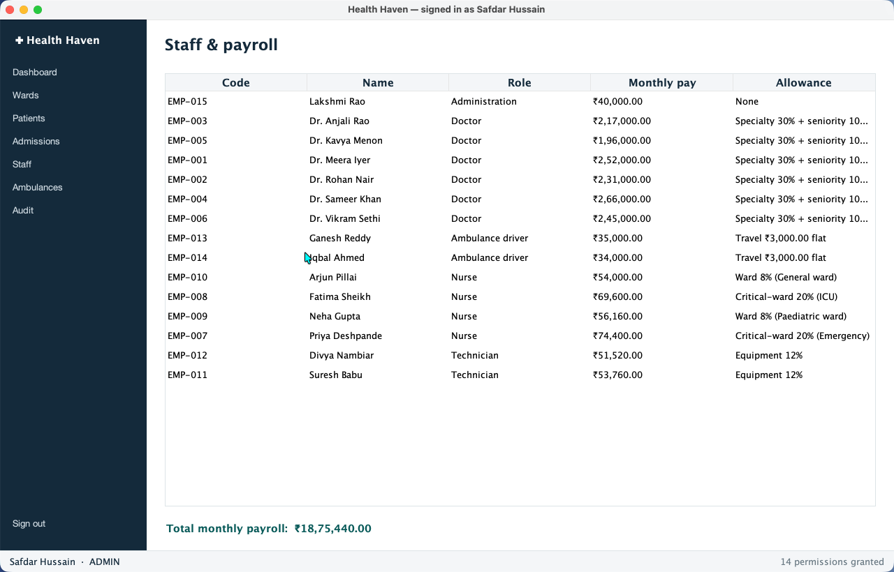

# Health Haven — Hospital Management System

A hospital management system in Java: patients, admissions, wards, billing, staff payroll,
ambulance dispatch and an append-only audit log — behind a layered domain model, a SQLite
database, and three interfaces (desktop app, CLI, JSON API).

**[▶ Live dashboard](https://safdar-hussain1.github.io/health-haven/)** · 35 tests · zero setup (`mvn package && java -jar target/health-haven.jar`)

<p align="center">
  
  
</p>
<p align="center">
  
</p>

---

## What it does

A hospital runs on answers to small, unforgiving questions. Which beds are free? How long has
this patient been in one? What do they owe? Health Haven answers them.

| | |
|---|---|
| **Admissions** | Admit a patient into a free bed, or refuse — an occupied room is rejected by the database itself, not by a hopeful flag. Discharge closes the stay and issues an invoice. |
| **Billing** | Nights × rate, plus procedures, pharmacy and transport, less the deposit. An over-deposit is a refund, stated as one. Invoices are frozen at discharge. |
| **Wards** | 30 beds across four ward types. Occupancy is *derived* from active admissions, so it cannot drift. |
| **Patients** | A permanent medical record number per person. Only the last four digits of an ID document are retained. |
| **Payroll** | Each staff class computes its own pay from its own rules; payroll sums a mixed list without asking what is in it. |
| **Ambulances** | Dispatch and recall. One vehicle cannot be sent to two emergencies at once. |
| **Access control** | Bcrypt passwords (cost 12) and role permissions checked in the service layer, so a disabled button is a courtesy, not a control. |
| **Audit log** | Append-only. Every mutation records who did it, to what, and when. |

Three interfaces sit over one service layer, so none of them can disagree with the others:
a Swing desktop client, a console, and a token-authenticated JSON API.

---

## Results from the running system

Numbers below come from a deterministic seeded hospital (58 patients over six months, 30 beds,
15 staff) and are produced by the application itself — `java -jar target/health-haven.jar export`
writes them to [`docs/data/dashboard.json`](docs/data/dashboard.json), which is the only thing
the live dashboard reads. Nothing on the dashboard or in this README is typed in by hand.

**Hospital at a glance**

| Metric | Value |
|---|---|
| Patients registered | 58 |
| Currently admitted | 18 |
| Bed occupancy | 18 / 30 (60%) |
| Mean completed stay | 8.3 nights |
| Invoices issued | 40 |
| Total billed | ₹20,78,200 |
| Outstanding | ₹15,17,900 |
| Monthly payroll | ₹18,75,440 |

**Occupancy by ward type**

| Ward type | Rate/night | Beds | Occupied | Free |
|---|---|---|---|---|
| General ward | ₹1,200 | 12 | 7 | 5 |
| Semi-private | ₹2,500 | 8 | 6 | 2 |
| Private | ₹4,500 | 6 | 4 | 2 |
| Intensive care | ₹9,000 | 4 | 1 | 3 |

**Revenue mix** — room and board is 77% of billings, which is what makes F2 so costly: the one
number the naive formula gets wrong is the one that dominates the bill.

| Charge type | Billed |
|---|---|
| Room & board | ₹15,97,500 |
| Procedures | ₹4,52,500 |
| Pharmacy | ₹1,04,100 |
| Consultations | ₹69,600 |
| Ambulance | ₹30,000 |

**Payroll, computed polymorphically** — each row is `monthlyPay()` summed over that role's staff.

| Role | Count | Monthly |
|---|---|---|
| Doctor | 6 | ₹14,07,000 |
| Nurse | 4 | ₹2,54,160 |
| Technician | 2 | ₹1,05,280 |
| Ambulance driver | 2 | ₹69,000 |
| Administration | 1 | ₹40,000 |
| **Total** | **15** | **₹18,75,440** |

---

## Install and run

Needs JDK 21+ and Maven. No database server, no configuration — the schema is created and
seeded on first run into `data/health-haven.db`.

```bash
git clone https://github.com/safdar-hussain1/health-haven.git
cd health-haven
mvn package                                   # compiles, runs 35 tests, builds the fat jar
```

Then pick an interface:

```bash
java -jar target/health-haven.jar             # desktop app (Swing + FlatLaf)
java -jar target/health-haven.jar cli help    # console
java -jar target/health-haven.jar serve 8080  # JSON API (loopback, bearer token)
java -jar target/health-haven.jar audit       # naive vs Health Haven, run live
java -jar target/health-haven.jar export      # regenerate docs/data/dashboard.json
```

The API serves patient names, MRNs and diagnoses, so it is not open: it binds to
loopback only, and every `/api` route needs a bearer token, which `serve` prints at startup
(or set `HEALTH_HAVEN_API_TOKEN` to pin it).

```bash
curl -H "Authorization: Bearer $HEALTH_HAVEN_API_TOKEN" http://localhost:8080/api/summary
```

Demo accounts (seeded, and listed on the login screen — click one to fill the form):

| Username | Password | Role |
|---|---|---|
| `admin` | `aurora@35` | Administrator — everything |
| `reception` | `changeme-desk` | Receptionist — register, admit, discharge, dispatch |
| `dr.iyer` | `changeme-doc1` | Doctor — view patients and admissions, record charges |

The roles are enforced in the service layer, not the UI: sign in as `dr.iyer` and try to discharge
someone and `AuthService.require` throws, because the doctor role has no discharge permission.

Useful CLI commands:

```bash
java -jar target/health-haven.jar cli dashboard    # status at a glance
java -jar target/health-haven.jar cli beds         # every room and its state
java -jar target/health-haven.jar cli admissions   # who is currently admitted
java -jar target/health-haven.jar cli bill 7       # print the live bill for admission #7
java -jar target/health-haven.jar cli payroll      # headcount and total monthly payroll
```

---

## How it is put together

Four layers, each depending only on the one beneath it. The domain layer has no idea a
database exists.

```
ui/ (Swing)   cli/   web/ (JSON API)     ← three interchangeable surfaces
        └──────────┬──────────┘
              service/                    ← business rules, permissions, transactions
                  │                         AuthService, AdmissionService, BillingService,
                  │                         StaffService, AmbulanceService, ReportingService
             repository/                  ← interfaces; JDBC implementations, all parameterised
                  │
               domain/                    ← Person→Patient/StaffMember→Doctor|Nurse|…,
                                            Room, Admission, Money, billing/{BillableItem,
                                            RoomCharge, ExtraCharge, Invoice}
```

```
health-haven/
├── src/main/java/com/healthhaven/
│   ├── domain/          entities, value objects, the staff and billing hierarchies
│   ├── repository/      persistence interfaces + jdbc/ implementations
│   ├── service/         business logic and permission checks
│   ├── db/              connection handling, transactions, schema migration, demo data
│   ├── validation/      fail-fast constructors (Validate, ValidationException)
│   ├── naive/           the obvious implementation, kept for the comparison
│   ├── report/          audit report + dashboard exporter
│   ├── cli/  ui/  web/  the three surfaces
│   └── Main.java        entry point / dispatcher
├── src/main/resources/db/schema.sql
├── src/test/java/       35 tests, incl. the naive-vs-Health-Haven comparison
└── docs/                dashboard (index.html + data/dashboard.json), design notes
```

Further reading: [`docs/OOP_DESIGN.md`](docs/OOP_DESIGN.md) (the four pillars, mapped to real
classes) and [`docs/ARCHITECTURE.md`](docs/ARCHITECTURE.md) (layering, transactions, the
database invariants).

### Invariants pushed into the database

Application code is the first line of defence and the schema is the last, so the rules that
must never break live in [`schema.sql`](src/main/resources/db/schema.sql):

- a room can hold at most one active admission (partial unique index) — F4 cannot recur;
- a patient cannot be admitted twice at once (partial unique index);
- an admission is `ACTIVE` with no discharge time, or `DISCHARGED` with one — never both;
- money is `INTEGER` paise, never a float and never a string;
- `audit_log` is append-only: every mutation records actor, action, entity and timestamp.

## Where the OOP earns its keep

Two places, and they are worth showing rather than reciting.

**Payroll.** `StaffMember` is abstract with an abstract `monthlyPay()`. A `Doctor` adds a 30%
specialty allowance (plus 10% past five years' service), a `Nurse` on a critical ward adds 20%,
a `Driver` adds a flat ₹3,000. `StaffService.monthlyPayroll()` sums a `List<StaffMember>` and
never asks what anything is:

```java
public Money monthlyPayroll(List<StaffMember> staff) {
    return staff.stream()
            .map(StaffMember::monthlyPay)     // Doctor? Nurse? Driver? Doesn't matter.
            .reduce(Money.ZERO, Money::plus);
}
```

Only the base salary is stored. Adding a `Pharmacist` tomorrow means writing one class and
touching nothing else — no `instanceof`, no switch.

**Billing.** `Invoice` totals a `List<BillableItem>` the same way. A `RoomCharge` computes itself
as nights × the room's nightly rate; an `ExtraCharge` (a scan, a drug, an ambulance ride) is a
quantity × a unit price. They are computed by completely different code, and the invoice adds
them up without distinguishing.

The hierarchy is sealed — `Person` permits only `Patient` and `StaffMember` — so the set of
people the system recognises is closed and can be reasoned about exhaustively. Full notes in
[`docs/OOP_DESIGN.md`](docs/OOP_DESIGN.md).

---

## Why it's built this way

Several decisions here cost more than the obvious alternative: parameterised SQL, an invoice
that knows about length of stay, discharge as an archive, occupancy derived rather than stored.
Each is easy to dismiss as over-engineering until you watch what happens without it.

So the repository contains both. [`naive/NaiveHospital`](src/main/java/com/healthhaven/naive/NaiveHospital.java)
implements the obvious alternative — the version that compiles, runs, and is wrong — and
[`NaiveApproachComparisonTest`](src/test/java/com/healthhaven/audit/NaiveApproachComparisonTest.java)
runs both on the same inputs. The difference is measured, not argued about:

```bash
java -jar target/health-haven.jar audit
```

| # | The trap | What the naive version does | What Health Haven does |
|---|---|---|---|
| **C1** | Building the login query by string concatenation | The password `' OR '1'='1` signs you in as anybody, and passwords sit in the table in plain text | Parameterised queries throughout; bcrypt hashes (cost 12). The payload is a value, and fails. |
| **C2** | Billing a stay as `rate − deposit` | `rate` is the price of *one night*, so a 1-night and a 20-night stay cost the same. Across the 40 invoices this hospital issues: **₹1,80,000 billed against a true ₹20,78,200 — a 91.3% shortfall — and all 40 bills come out negative** | `nights × rate + extras − deposit`, over a polymorphic `List<BillableItem>`. Nights round up and are never zero. An over-deposit is reported as a refund. |
| **C3** | Discharge as `delete from patient` | The hospital forgets every patient it discharges. A returning patient is a stranger. | Discharge closes the `Admission` and issues an `Invoice`. The patient and their full history are kept forever. |
| **C4** | Occupancy as an `Availability` column | Every screen that admits or discharges must remember to update it, so it drifts — and two patients end up in one bed | Occupancy is derived from active admissions, and a partial unique index makes the second admission impossible at the database level. |

C2 is the expensive one, and the reason is in the revenue mix above: room and board is 77% of
billings, so the single number the naive formula gets wrong is the one that dominates the bill.

---

## Tests

```bash
mvn test        # 35 tests
```

They cover the `Money` value object, billing arithmetic (including the round-up-and-never-zero
night rule), polymorphic payroll over a mixed staff list, fail-fast validation, repository
round-trips, derived occupancy, ambulance dispatch, the API's refusal to serve patient data
without a token — and the four correctness scenarios, each running the naive implementation and
Health Haven against the same inputs.

## Tech stack

Java 21 · Maven · SQLite (`sqlite-jdbc`) · bcrypt (`at.favre.lib`) · Swing + FlatLaf ·
JUnit 5 + AssertJ · the JDK's built-in `HttpServer` for the API · Chart.js on the dashboard.

## Licence

MIT — see [LICENSE](LICENSE).
