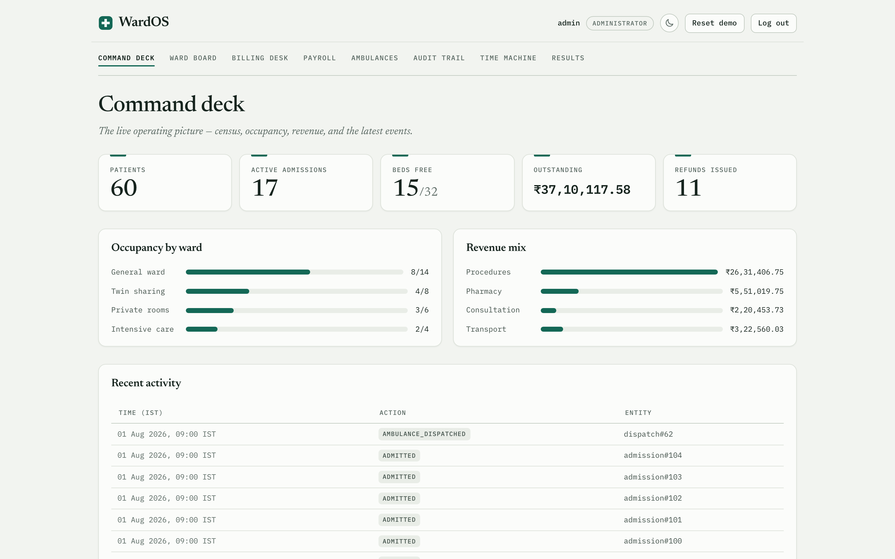
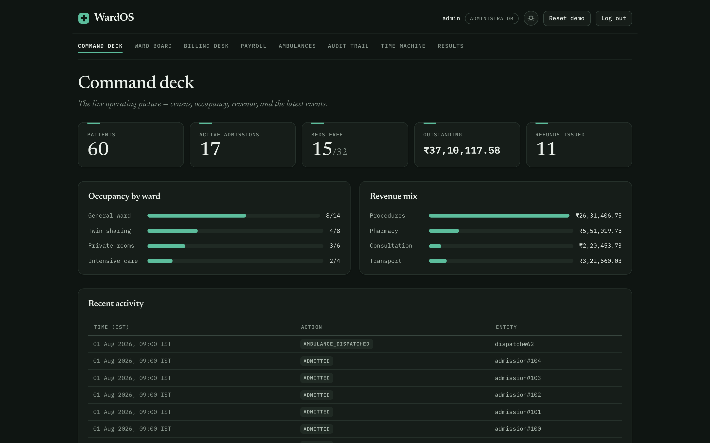

# WardOS

<p align="center">
  
  
</p>

A hospital's whole operating picture — every bed, every bill, every shift — running entirely in your browser. Beds, admissions, billing, payroll, ambulance dispatch, role-based access, and a complete audit history, backed by a real SQLite database (WASM) that lives on your device. The published site is not a demo of the product; it **is** the product, seeded with a deterministic six-month hospital so you can use every feature within seconds of the page loading.

**Live:** https://safdar-hussain1.github.io/wardos/

**318 tests · zero server · every byte stays on your device**

## What's in it

| Screen | What it does |
|---|---|
| **Command deck** | The live operating picture: census, occupancy by ward, revenue mix, latest events |
| **Ward board** | All 32 beds as a live grid — click a bed to admit, view, transfer, or discharge |
| **Billing desk** | Itemized invoices that recompute as charges land; the refund case stated as one, never a negative charge |
| **Payroll** | Five staff types, each with its own pay rule — click a person and watch their rule compute their pay |
| **Ambulances** | A fleet of four; dispatch and return, one open dispatch per vehicle, transport charges attach to admissions |
| **Audit trail** | The append-only event log, human-readable — every command, actor, and instant |
| **Time machine** | Scrub the hospital through six months of history; every scrubber position is a full replay of the event log up to that instant |
| **Roles** | Five roles behind real logins (bcrypt-hashed passwords); permissions enforced in the command layer, not the interface |

## Results from the running system

Every figure below is exported from the seeded database by `wardos export` and committed as JSON (`src/app/data/summary.json`). The site's Results screen renders the same file — one source, no drift.

**Census** — 60 patients, 17 active admissions, 15 of 32 beds free.

**Occupancy by ward**

| Ward | Rate / night | Occupied | Free | Beds |
|---|---|---|---|---|
| General | ₹1,500 | 8 | 6 | 14 |
| Twin sharing | ₹2,800 | 4 | 4 | 8 |
| Private | ₹5,000 | 3 | 3 | 6 |
| Intensive care | ₹9,500 | 2 | 2 | 4 |

**Revenue by charge kind**

| Kind | Total |
|---|---|
| Procedures | ₹26,31,406.75 |
| Pharmacy | ₹5,51,019.75 |
| Transport | ₹3,22,560.03 |
| Consultation | ₹2,20,453.73 |
| **Total** | **₹37,25,440.26** |

**Payroll by role**

| Role | Headcount | Monthly total |
|---|---|---|
| Doctor | 6 | ₹12,10,713.13 |
| Nurse | 4 | ₹1,77,154.74 |
| Technician | 2 | ₹67,189.63 |
| Driver | 2 | ₹65,474.07 |
| Administrator | 1 | ₹49,664.72 |
| **Total** | | **₹15,70,196.29** |

Outstanding balance across discharged invoices: ₹37,10,117.58. Refunds issued: 11.

## The benchmark: three ways hospital back-offices go wrong

`src/naive/` reimplements, faithfully and in isolation, the standard failure modes hospital back-offices are prone to. The identical six-month command stream — 1,313 commands — is run through each baseline and through WardOS, checked against the same truth oracle. The numbers below are real output, regenerated by `npm run benchmark` and committed as `src/app/data/benchmark.json` (the run is deterministic; regenerating produces a byte-identical file).

**N1 — float money.** Bills in rupee doubles instead of integer paise, then applies a 2.5% service adjustment that's added and "removed" — but the removal computes 2.5% of the already-inflated total, not the original, leaving a real ×0.999375 (−0.0625% residue) on every bill in exact arithmetic, before float representation error is even a factor.

| | |
|---|---|
| Invoices wrong | **87** |
| Worst single error | ₹173.43 (17,343 paise) |
| Total misbilled | ₹2,438.99 (243,899 paise) |

**N2 — hand-maintained occupancy flag.** Tracks bed occupancy with a second, hand-maintained flag written separately from the admission record, and drops that second write on every 7th discharge and every 11th admit — 21 injected crashes (9 on admit, 12 on discharge) over the six months.

One structural point the numbers force you to notice: an accepted double booking cannot even be measured by replaying a valid log — the schema that produced the history never allowed a colliding admit to exist, so the flag's acceptance verdict is never put to a real conflict. What a crash-prone flag system actually produces is **phantom-free beds** (a truly occupied bed reading free to anyone who trusts the flag — the double-booking hazard) and **wrongful refusals** of genuinely free beds.

| | |
|---|---|
| Wrongful refusals of a free bed | **7** |
| Phantom-free beds (double-booking hazard) | **8** |
| Phantom-free beds still unresolved at the end | 1 |
| Beds still drifted at the end | 3 |
| Crashes injected (admit / discharge) | 21 (9 / 12) |

**N3 — millisecond date math.** Counts nights as `round((dischargeMs − admitMs) / 86,400,000)` — raw elapsed time, no timezone, no one-night minimum — instead of counting IST calendar days crossed. A same-day day case under 12 hours rounds to 0 nights instead of the correct 1.

| | |
|---|---|
| Invoices wrong | **23** |
| Nights underbilled | 13 |
| Nights overbilled | 10 |
| Day cases wrongly freed (0 nights billed) | 9 |

**WardOS — on the identical history**

| | |
|---|---|
| Invoices wrong | **0** of 87 checked |
| Beds drifted | **0** of 32 checked |
| Double-bookings accepted | **0** across 104 admissions |

## Five claims, each mutation-tested

Every headline claim has a test that fails when the enforcement is deliberately removed. Each mutation below was applied, the full suite run, the failures recorded, and the mutation reverted — no mutation survived.

| # | Claim | Enforced by | Mutation applied | Killed by |
|---|---|---|---|---|
| C1 | Double-booking a bed is structurally impossible | Partial unique index on active admissions per bed, in the schema itself — not application code | Delete the `uq_active_bed` index from `schema.sql` | 4 tests across 3 files |
| C2 | The event log is sufficient: replaying it reproduces the exact live state | Every mutating command appends one event, in the same transaction, before it commits | Turn `CHARGE_ADDED` into a no-op during replay | 4 tests across 3 files |
| C3 | Billing direction is right: an over-deposit yields a refund, never a negative charge | One balance computation — room total plus extras, minus deposit — with the sign read afterward, not chosen upfront | Flip the sign in the balance computation | 11 tests across 5 files |
| C4 | Money never floats | Every amount is an integer number of paise end to end, validated at every command boundary | Drop the `requirePaise` boundary check from `addCharge` | 2 tests in 1 file |
| C5 | Permissions are enforced in the command layer, not the interface | Every command checks the actor's role against a permission matrix before touching the database | Drop the `requirePermission` check from `discharge` | 3 tests in 1 file |

## Install and run

```sh
git clone https://github.com/safdar-hussain1/wardos
cd wardos
npm ci
npm test       # 318 tests, 19 files
npm run dev    # the app, on a local Vite server
```

The same engine runs headless from the command line:

```sh
node bin/wardos.mjs seed   --db /tmp/hospital.db   # seed a fresh six-month hospital
node bin/wardos.mjs beds   --db /tmp/hospital.db   # every bed and its occupancy state
node bin/wardos.mjs report --db /tmp/hospital.db   # census, revenue, payroll, outstanding
node bin/wardos.mjs bill 1 --db /tmp/hospital.db   # itemized invoice for admission 1
node bin/wardos.mjs verify --db /tmp/hospital.db   # replay(events) vs live db; exit 1 on mismatch
node bin/wardos.mjs export --db /tmp/hospital.db   # write summary.json for the Results screen
```

`verify` on a fresh seed prints:

```
PASS: replay of 1313 events matches the live database exactly.
```

Seeding is deterministic: two seeds in separate processes produce byte-identical databases (a test pins the SHA-256 of the committed snapshot to a fresh seed's).

**Demo accounts** (shown as clickable cards on the login screen):

| Username | Password | Role |
|---|---|---|
| `admin` | `wardos-admin` | Administrator |
| `reception` | `wardos-desk` | Receptionist |
| `dr.rao` | `wardos-rounds` | Doctor |
| `nurse.k` | `wardos-ward` | Nurse |
| `billing` | `wardos-desk2` | Billing clerk |

**URL hooks:** `?as=reception` logs straight in as a demo role; `?screen=billing` deep-links the first session to a screen (`deck`, `wards`, `billing`, `payroll`, `ambulances`, `audit`, `time-machine`, `about`); `?selftest=1` runs three in-page engine checks (golden invoice, C1 constraint probe, replay spot-check) and writes `WARDOS-SELFTEST: PASS 3/3` into the document title for headless verification.

## Architecture

One engine, three surfaces. The browser app, the CLI, and the test suite all drive the same TypeScript engine over the same SQLite schema — the interface carries no billing math, no permission rules, no double-booking logic.

```
┌─────────────┐  ┌─────────────┐  ┌───────────────┐
│ browser SPA │  │  Node CLI   │  │  test harness │
│  (src/app)  │  │  (src/cli)  │  │   (tests/)    │
└──────┬──────┘  └──────┬──────┘  └───────┬───────┘
       └────────────────┼─────────────────┘
                        ▼
              engine  (src/core)
        commands · billing · payroll ·
        permissions · replay · money · clock
                        ▼
              sqlite  (src/db)
        schema constraints · transactions
                        ▼
     sql.js (WASM) — IndexedDB in the browser,
              a .db file on Node
```

```
wardos/
├── bin/          wardos.mjs — CLI entry
├── docs/         committed production build — the GitHub Pages site
├── public/       demo.db snapshot, sql-wasm.wasm
├── scripts/      copy-wasm, run-benchmark
├── src/
│   ├── core/     pure domain: engine, billing, payroll, permissions, replay, money, clock, events
│   ├── db/       schema.sql, sql.js adapter, transactions
│   ├── seed/     the deterministic six-month hospital
│   ├── naive/    the three baselines — imported only by the benchmark, never by the app
│   ├── bench/    benchmark harness and truth oracle
│   ├── cli/      the CLI over the engine
│   └── app/      React SPA — renders engine state, issues engine commands
└── tests/        19 files, 318 tests
```

Details in [docs/ARCHITECTURE.md](docs/ARCHITECTURE.md). Invariants, threat model, and what the system does *not* claim: [docs/DESIGN_CARD.md](docs/DESIGN_CARD.md).

## What this is not

- **Not a server product.** Single facility, single device, demo-seeded. Nothing you do here leaves your device — there is no server behind the site after the page loads, and the production bundle is scanned by a test for any absolute-origin network call.
- **Not live time.** The clock is frozen at a fixed anchor instant; every published figure is dated, not drifting against a calendar. That freeze is what makes the seed, the benchmark, and every number above reproducible to the byte.
- **Not networked auth.** Accounts and roles are real in structure — hashed passwords, per-command permission checks — but they protect the integrity of this local demo's data, not a networked deployment.
- **Not durable storage.** The browser database lives in IndexedDB, which the browser may evict under storage pressure. "Reset demo" always restores a clean seeded hospital, so nothing is ever unrecoverable.
- **Not a medical device.** It manages beds, bills, payroll, and dispatch — not diagnoses or treatment.

## License

MIT — see [LICENSE](LICENSE).
