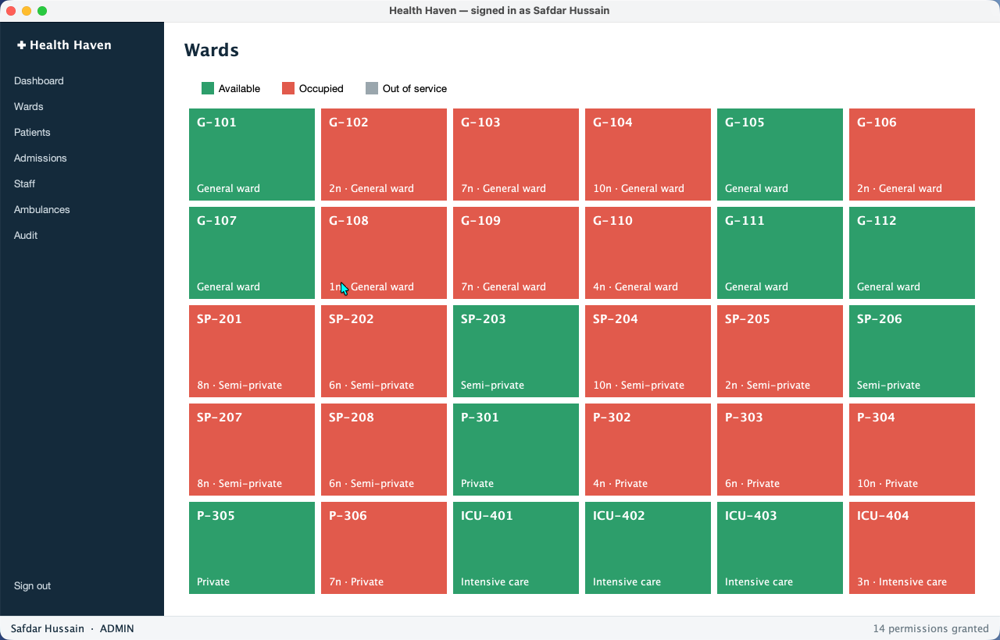
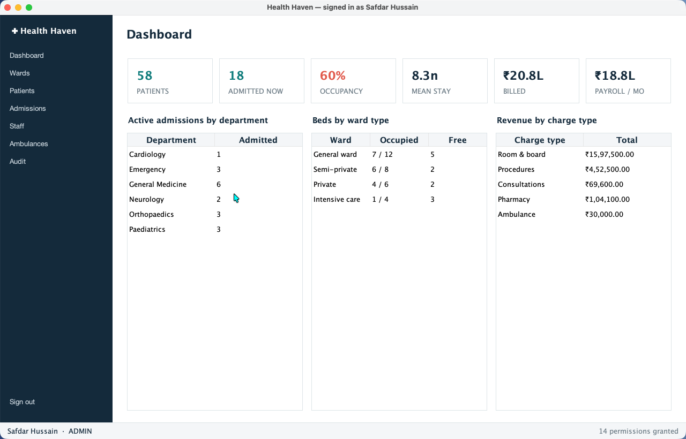

# Health Haven — Hospital Management System

A hospital management system in Java: patients, admissions, wards, billing, staff payroll,
ambulance dispatch and an append-only audit log — behind a layered domain model, a SQLite
database, and three interfaces (desktop app, CLI, JSON API).

**[▶ Live dashboard](https://safdar-hussain1.github.io/health-haven/)** · 35 tests · zero setup (`mvn package && java -jar target/health-haven.jar`)

<p align="center">
  
  
</p>

---

## The short version

This started as a college OOP project — a Java Swing app talking to MySQL. Going back over
it, the code had four defects that mattered, and one of them was expensive. I rebuilt the
system properly and kept the original's logic in a `legacy/` package so both versions can be
run side by side and the difference measured rather than asserted.

The headline: **the original's billing formula ignored how long a patient stayed.** It
computed the amount owed as `roomRate − deposit`, where `roomRate` is the rate for *one
night*. Replayed across the 40 invoices this system issues from its seeded hospital, that
formula bills **₹1,80,000 against a true ₹20,78,200 — a 91.3% revenue shortfall — and every
single one of the 40 bills comes out negative**, i.e. the screen would have told the desk
clerk that the hospital owed the patient money.

Run it yourself:

```bash
java -jar target/health-haven.jar audit
```

---

## What was wrong, and what it does now

Each finding below is reproduced by a test in
[`LegacyBugReproductionTest`](src/test/java/com/healthhaven/audit/LegacyBugReproductionTest.java),
which runs the original's logic (from [`LegacyHospital`](src/main/java/com/healthhaven/legacy/LegacyHospital.java),
a faithful extraction of the 2024 code) and then the rebuilt system on the same scenario.

| # | Defect in the original | What actually happened | How it works now |
|---|---|---|---|
| **F1** | **Login was open to SQL injection.** `Login.java` built the query by concatenation: `"select * from login where ID = '" + user + "' and PW = '" + pass + "'"` | Signing in with the password `' OR '1'='1` and *any* username returns a row, so the check passes. Passwords were stored in plain text in a `login` table. | Parameterised queries everywhere; passwords are bcrypt hashes (cost 12). The same payload is treated as a literal string and fails. |
| **F2** | **The bill ignored length of stay.** `Update_Patient_Details.java`: `Integer.parseInt(price) - Integer.parseInt(deposit)` | A 1-night and a 20-night stay in the same room produce the same bill. Across 40 real invoices: **₹1,80,000 billed vs ₹20,78,200 owed (−91.3%)**, and **40/40 bills negative**. | `nights × nightlyRate + extras − deposit`, computed by a `BillingService` over a polymorphic `List<BillableItem>`. Nights round up and are never zero. An over-deposit is reported as an explicit refund. |
| **F3** | **Discharge deleted the patient.** `Patient_Discharge.java`: `delete from Patient_Info where number = ...` | The hospital forgot every discharged patient permanently. A returning patient was a brand new person with no history. | Discharge closes an `Admission` row and issues an `Invoice`. Patients and their full stay history are retained; nothing is ever deleted. |
| **F4** | **Two patients could share one bed.** Occupancy was an `Availability` text column updated by hand from three screens. | Both admissions to the same room succeed. Occupancy drifted out of step with reality constantly. | Occupancy is *derived* from active admissions, and a partial unique index (`WHERE status='ACTIVE'`) makes a second admission to an occupied room impossible at the database level. |

Two more things the original got wrong that aren't "findings" so much as hygiene: the
developer's own MySQL root password was hardcoded in `Connect.java` and committed, and every
one of the ~40 `catch` blocks was `e.printStackTrace()` — so failed operations silently did
nothing while the UI carried on as though they had worked.

### And the OOP, since that was the point of the course

The original had twelve classes. All twelve extended `JFrame`, and each one opened its own
database connection, wrote its own SQL, and did its own arithmetic inside a button handler.
There was no patient type, no staff type, no bill — the data existed only as strings in text
fields. Inheritance was used exactly once, to get a window.

The rebuild uses the four pillars where they actually pay for themselves —
[`docs/OOP_DESIGN.md`](docs/OOP_DESIGN.md) maps each one to the class that demonstrates it.
The short version:

- **Abstraction** — `Person` (sealed) is what the hospital knows about a human; `Patient` and
  `StaffMember` extend it.
- **Inheritance & polymorphism** — `StaffMember` is abstract with an abstract `monthlyPay()`.
  `Doctor` adds a 30% specialty allowance (plus 10% past five years), an ICU `Nurse` adds 20%,
  a `Driver` adds a flat ₹3,000. `StaffService.monthlyPayroll()` sums a `List<StaffMember>`
  without knowing or asking what any of them are. Same idea for billing: `Invoice` totals a
  `List<BillableItem>` where a `RoomCharge` (nights × rate) and an `ExtraCharge` (a scan, a
  drug) compute themselves completely differently.
- **Encapsulation** — `Money` is an immutable value object holding integer paise, so money is
  never a `String` parsed with `Integer.parseInt` at the point of use. `User` exposes no getter
  for its password hash at all.

---

## Results from the running system

Numbers below come from a deterministic seeded hospital (58 patients over six months, 30 beds,
15 staff) and are produced by the application itself — `java -jar target/health-haven.jar export`
writes them to [`docs/data/dashboard.json`](docs/data/dashboard.json), which is the only thing
the live dashboard reads. Nothing on the dashboard or in this README is typed in by hand.

**Hospital at a glance**

| Metric | Value |
|---|---|
| Patients registered | 58 |
| Currently admitted | 18 |
| Bed occupancy | 18 / 30 (60%) |
| Mean completed stay | 8.3 nights |
| Invoices issued | 40 |
| Total billed | ₹20,78,200 |
| Outstanding | ₹15,17,900 |
| Monthly payroll | ₹18,75,440 |

**Occupancy by ward type**

| Ward type | Rate/night | Beds | Occupied | Free |
|---|---|---|---|---|
| General ward | ₹1,200 | 12 | 7 | 5 |
| Semi-private | ₹2,500 | 8 | 6 | 2 |
| Private | ₹4,500 | 6 | 4 | 2 |
| Intensive care | ₹9,000 | 4 | 1 | 3 |

**Revenue mix** — room and board is 77% of billings, which is what makes F2 so costly: the one
number the original got wrong was the one that dominates the bill.

| Charge type | Billed |
|---|---|
| Room & board | ₹15,97,500 |
| Procedures | ₹4,52,500 |
| Pharmacy | ₹1,04,100 |
| Consultations | ₹69,600 |
| Ambulance | ₹30,000 |

**Payroll, computed polymorphically** — each row is `monthlyPay()` summed over that role's staff.

| Role | Count | Monthly |
|---|---|---|
| Doctor | 6 | ₹14,07,000 |
| Nurse | 4 | ₹2,54,160 |
| Technician | 2 | ₹1,05,280 |
| Ambulance driver | 2 | ₹69,000 |
| Administration | 1 | ₹40,000 |
| **Total** | **15** | **₹18,75,440** |

---

## Install and run

Needs JDK 21+ and Maven. No database server, no configuration — the schema is created and
seeded on first run into `data/health-haven.db`.

```bash
git clone https://github.com/safdar-hussain1/health-haven.git
cd health-haven
mvn package                                   # compiles, runs 35 tests, builds the fat jar
```

Then pick an interface:

```bash
java -jar target/health-haven.jar             # desktop app (Swing + FlatLaf)
java -jar target/health-haven.jar cli help    # console
java -jar target/health-haven.jar serve 8080  # JSON API (loopback, bearer token)
java -jar target/health-haven.jar audit       # the original-vs-rebuilt audit, live
java -jar target/health-haven.jar export      # regenerate docs/data/dashboard.json
```

The API serves patient names, MRNs and diagnoses, so it is not open: it binds to
loopback only, and every `/api` route needs a bearer token, which `serve` prints at startup
(or set `HEALTH_HAVEN_API_TOKEN` to pin it).

```bash
curl -H "Authorization: Bearer $HEALTH_HAVEN_API_TOKEN" http://localhost:8080/api/summary
```

Demo logins (seeded, and shown on the login screen): `admin` / `changeme-admin`,
`reception` / `changeme-desk`, `dr.iyer` / `changeme-doc1`.

Useful CLI commands:

```bash
java -jar target/health-haven.jar cli dashboard    # status at a glance
java -jar target/health-haven.jar cli beds         # every room and its state
java -jar target/health-haven.jar cli admissions   # who is currently admitted
java -jar target/health-haven.jar cli bill 7       # print the live bill for admission #7
java -jar target/health-haven.jar cli payroll      # headcount and total monthly payroll
```

---

## How it is put together

Four layers, each depending only on the one beneath it. The domain layer has no idea a
database exists.

```
ui/ (Swing)   cli/   web/ (JSON API)     ← three interchangeable surfaces
        └──────────┬──────────┘
              service/                    ← business rules, permissions, transactions
                  │                         AuthService, AdmissionService, BillingService,
                  │                         StaffService, AmbulanceService, ReportingService
             repository/                  ← interfaces; JDBC implementations, all parameterised
                  │
               domain/                    ← Person→Patient/StaffMember→Doctor|Nurse|…,
                                            Room, Admission, Money, billing/{BillableItem,
                                            RoomCharge, ExtraCharge, Invoice}
```

```
health-haven/
├── src/main/java/com/healthhaven/
│   ├── domain/          entities, value objects, the staff and billing hierarchies
│   ├── repository/      persistence interfaces + jdbc/ implementations
│   ├── service/         business logic and permission checks
│   ├── db/              connection handling, transactions, schema migration, demo data
│   ├── validation/      fail-fast constructors (Validate, ValidationException)
│   ├── legacy/          the original's logic, preserved for the audit
│   ├── report/          audit report + dashboard exporter
│   ├── cli/  ui/  web/  the three surfaces
│   └── Main.java        entry point / dispatcher
├── src/main/resources/db/schema.sql
├── src/test/java/       35 tests, incl. the legacy-vs-rebuilt audit
└── docs/                dashboard (index.html + data/dashboard.json), design notes
```

Further reading: [`docs/OOP_DESIGN.md`](docs/OOP_DESIGN.md) (the four pillars, mapped to real
classes) and [`docs/ARCHITECTURE.md`](docs/ARCHITECTURE.md) (layering, transactions, the
database invariants).

### Invariants pushed into the database

Application code is the first line of defence and the schema is the last, so the rules that
must never break live in [`schema.sql`](src/main/resources/db/schema.sql):

- a room can hold at most one active admission (partial unique index) — F4 cannot recur;
- a patient cannot be admitted twice at once (partial unique index);
- an admission is `ACTIVE` with no discharge time, or `DISCHARGED` with one — never both;
- money is `INTEGER` paise, never a float and never a string;
- `audit_log` is append-only: every mutation records actor, action, entity and timestamp.

## Tests

```bash
mvn test        # 35 tests
```

They cover the `Money` value object, billing arithmetic (including the round-up-and-never-zero
night rule), polymorphic payroll over a mixed staff list, fail-fast validation, repository
round-trips, derived occupancy, ambulance dispatch, the API's refusal to serve patient data
without a token — and the four audit scenarios, each running the original's logic and the
rebuilt system against the same inputs.

## Tech stack

Java 21 · Maven · SQLite (`sqlite-jdbc`) · bcrypt (`at.favre.lib`) · Swing + FlatLaf ·
JUnit 5 + AssertJ · the JDK's built-in `HttpServer` for the API · Chart.js on the dashboard.

## Licence

MIT — see [LICENSE](LICENSE).
